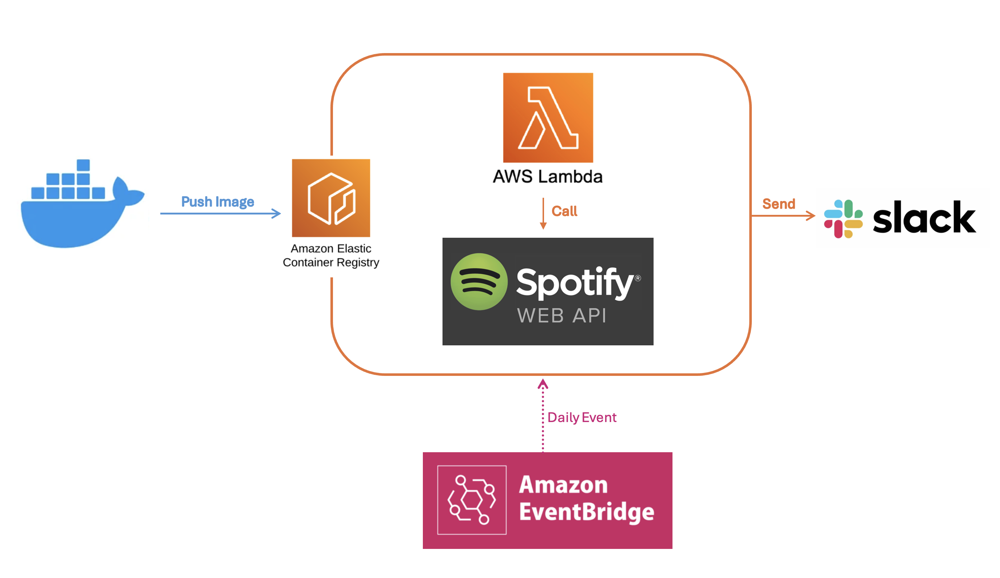

# MyDataEng Project
This GitHub Repository contains several personal POCs about Data Engineering. The main tools used are Python as programming language, AWS CDK as IaC and CircleCI as CI/CD.

Table of Contents

- [Daily Spotify Recommandation](#daily-spotify-recommandation)

## Daily Spotify Recommandation

The goal of this POC is to provide a daily recommandation from Spotify on a Slack Channel. I used :

* [AWS Lamdba Function with docker image](lambda_functions/spotify_daily/Dockerfile)
* AWS ECR as container to store my image
* AWS EventBridge to run the lambda function with a CRON

